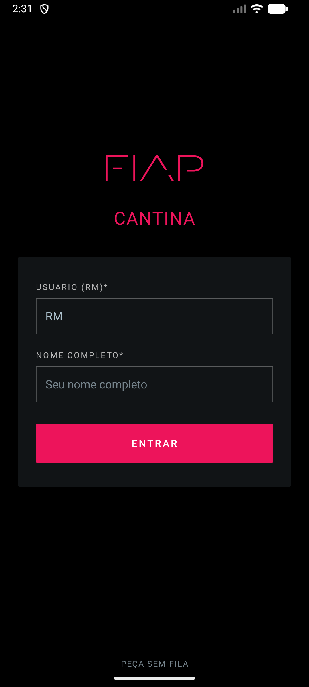
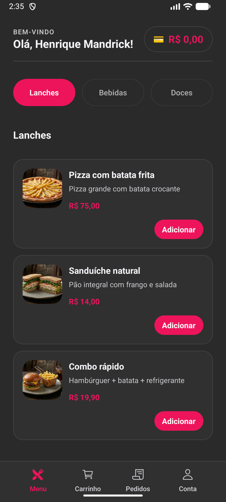
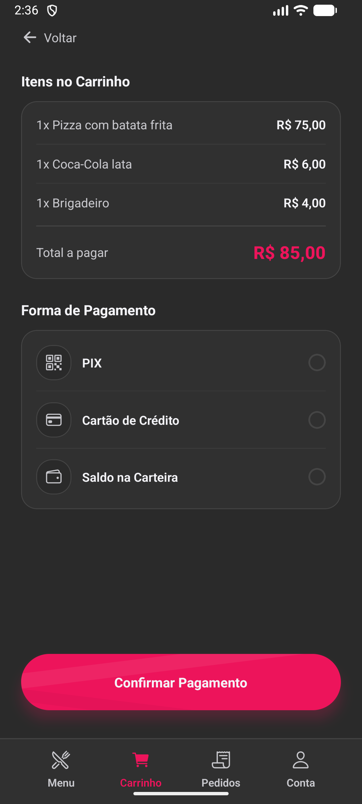
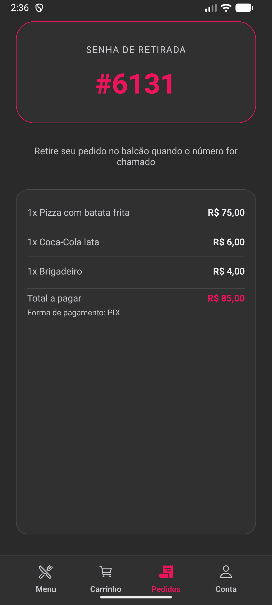
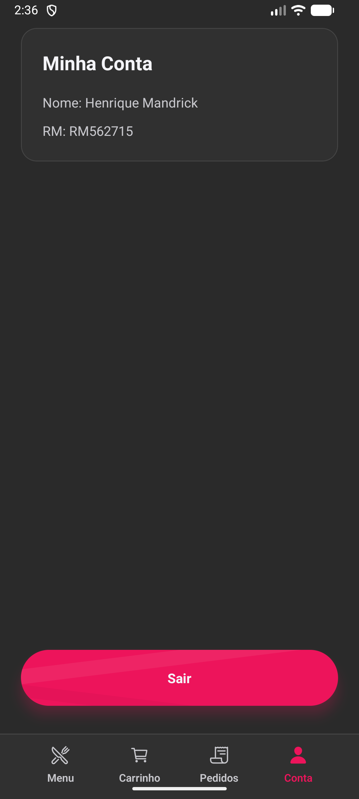

# Cantina FIAP

Aplicativo mobile desenvolvido como Checkpoint 1 da disciplina **Cross-Platform Application Development** — Ciência da Computação, 3º semestre (FIAP).

## Sobre o Projeto

A FIAP possui duas cantinas que ficam sobrecarregadas durante o horário de intervalo. O intervalo em si já é curto, e a fila acaba consumindo boa parte desse tempo.

A solução proposta é um app que permite aos alunos **escolher e pagar itens da cantina com antecedência**, gerando uma **senha de retirada**. Assim o aluno chega no balcão, informa a senha e retira o pedido — sem fila, sem espera.

### Funcionalidades

- Login com RM (6 dígitos) e nome do aluno
- Cardápio organizado por categorias (Lanches, Bebidas, Doces) com imagens
- Carrinho com controle de quantidade por item
- Tela de pagamento com seleção de forma (PIX, Cartão, Saldo)
- Tela de pedido final com senha de retirada e resumo completo
- Tela de conta com dados do usuário e logout

## Integrantes

| Nome |
|------|
| Helena Barbosa Costa |
| Henrique Mandrick |
| Mateus Scandiuzzi Valente Tomomitsu |
| Ryan Amorim de Castro Santana |
| Thomas Joh Kobayashi |

## Como Rodar

### Pré-requisitos

- [Node.js](https://nodejs.org/) v18 ou superior (recomendado v20 LTS)
- [Git](https://git-scm.com/) instalado
- [Expo Go](https://expo.dev/go) instalado no celular (Android ou iOS) para testar no dispositivo físico
- Alternativamente, [Android Studio](https://developer.android.com/studio) com um emulador configurado

### Passo a passo

```bash
# 1. Clone o repositório
git clone https://github.com/Matomomitsu/FIAP-CPAD-CP01.git

# 2. Entre na pasta do projeto
cd FIAP-CPAD-CP01

# 3. Instale as dependências
npm install

# 4. Inicie o servidor de desenvolvimento
npx expo start
```

Após iniciar, escaneie o QR Code exibido no terminal com o app **Expo Go** no celular, ou pressione `a` para abrir no emulador Android.

## Demonstração

### Telas do App

| Login | Cardápio | Pagamento |
|:-----:|:--------:|:---------:|
|  |  |  |

| Pedido Final | Minha Conta |
|:------------:|:-----------:|
|  |  |

### Vídeo demonstrativo

[](https://www.youtube.com/shorts/2UPpPNg-EF0)

## Decisões Técnicas

### Estrutura do projeto

```
app/              → Telas (file-based routing via Expo Router)
components/       → Componentes reutilizáveis (FoodCard, PrimaryButton, AppFooter, etc.)
contexts/         → Estado global com Context API (UserContext, CartContext, OrderContext)
styles/           → Tokens de tema centralizados (cores, espaçamentos, bordas)
utils/            → Funções auxiliares (formatPrice)
assets/images/    → Imagens dos itens do cardápio e screenshots
```

O projeto foi dividido em **7 componentes reutilizáveis**, **3 contextos** e **5 telas funcionais**. Cada arquivo tem uma responsabilidade clara — telas cuidam do fluxo, componentes cuidam da apresentação, e contextos compartilham estado entre as telas.

### Hooks utilizados

- **`useState`** — controle de estado local em todas as telas: campos de formulário no login, categoria selecionada no cardápio, forma de pagamento e estado de processamento no pagamento.
- **`useContext`** — consumo dos providers globais (`useUser`, `useCart`, `useOrder`) para que dados como usuário logado, itens do carrinho e dados do pedido confirmado estejam acessíveis em qualquer tela sem precisar passar props manualmente entre elas.

### Navegação

A navegação usa **Expo Router** com roteamento baseado em arquivos. O layout raiz (`_layout.js`) configura um `Stack` com animação `slide_from_right` e envolve toda a árvore com os providers de contexto. A navegação programática é feita com `router.push()`, `router.back()` e `router.replace()`.

### Cardápio e uso do componente Image

O cardápio exibe os itens em cards (`FoodCard`) com imagem, nome, descrição e preço. As imagens são carregadas localmente via `require()` e renderizadas com o componente `Image` do React Native. Um filtro por categoria (Lanches, Bebidas, Doces) permite alternar entre os itens usando um componente de botões segmentados. O controle de quantidade (+/-) atualiza o carrinho em tempo real via `CartContext`.

### Pagamento e pedido final

A tela de pagamento lista os itens do carrinho com subtotais, exibe o total e oferece seleção de forma de pagamento (PIX, Cartão, Saldo) com feedback visual de radio buttons. Ao confirmar, os dados do pedido são salvos no `OrderContext` e o carrinho é limpo. A tela de pedido final lê esses dados e exibe a senha de retirada, o resumo dos itens, o total pago e a forma de pagamento escolhida.

### Login e logo SVG

A tela de login inclui validação de RM (exatamente 6 dígitos) e nome obrigatório, com feedback de erro e estado de loading. O logo da FIAP foi reproduzido usando `react-native-svg` — a única biblioteca adicional ao template — para replicar o logo vetorial visto no portal [on.fiap.com.br](https://on.fiap.com.br/), que utiliza SVG.

### Estilização

Todos os estilos usam `StyleSheet.create()`. As cores, espaçamentos e border radius vêm de um arquivo de tema centralizado (`styles/theme.js`), garantindo consistência visual em todas as telas. O app segue um tema escuro com a cor primária da FIAP (`#ED145B`).

## Próximos Passos

Com mais tempo, implementaríamos:

- **Histórico de pedidos** — permitir que o aluno consulte pedidos anteriores com data, itens e valor
- **Status do pedido em tempo real** — indicar se o pedido está sendo preparado, pronto para retirada ou já retirado
- **Integração com backend** — persistir dados e autenticar via API
- **Notificações push** — avisar o aluno quando o pedido estiver pronto
